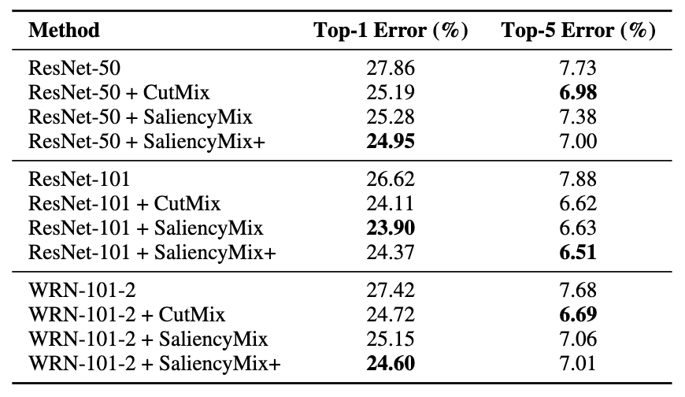
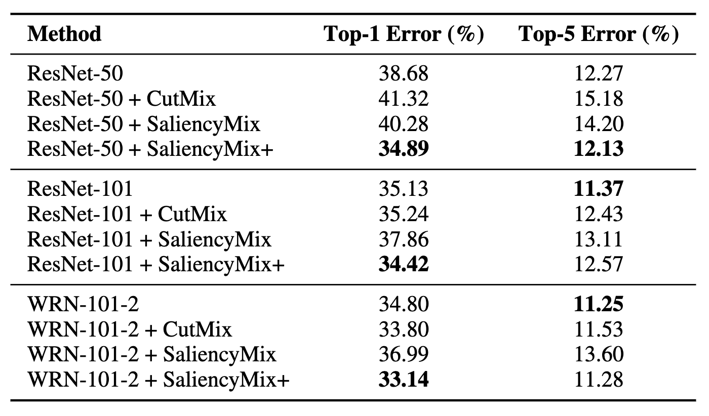

# SaliencyMix+: Noise-Minimized Image Mixing Method with Saliency Map in Data Augmentation


Our implementation is based on these repositories:
- [CutMix-PyTorch](https://github.com/clovaai/CutMix-PyTorch)
- [SaliencyMix](https://github.com/afm-shahab-uddin/SaliencyMix)


## Abstract
Data augmentation is vital in deep learning for enhancing model robustness by artificially expanding training datasets. However, advanced methods like CutMix blend images and assign labels based on pixel ratios, often introducing label noise by neglecting the significance of blended regions, and SaliencyMix applies uniform patch generation across a batch, resulting in suboptimal augmentation. This paper introduces SaliencyMix+, a novel data augmentation technique that enhances the performance of deep-learning models using saliency maps for image mixing and label generation. It identifies critical patch coordinates in batch images and refines label generation based on target object proportions, reducing label noise. Experiments on CIFAR-100 and Oxford-IIIT Pet datasets show that SaliencyMix+ consistently outperforms CutMix and SaliencyMix, achieving the lowest Top-1 errors of 24.95% and 34.89%, and Top- 5 errors of 7.00% and 12.13% on CIFAR-100 and Oxford-IIIT Pet, respectively. These findings highlight the effectiveness of SaliencyMix+ in boosting model accuracy and robustness across different models and datasets.


## Performance 

### CIFAR-100



### Oxford-IIIT Pet



## Installation

``` shell
git clone https://github.com/SS-hj/SaliencyMixPlus.git
cd SaliencyMixPlus
conda create -n saliencymixplus python=3.8
conda activate saliencymixplus
pip install -r requirements.txt
```

</details>

## Training

### Data preparation

``` shell
bash get_oxford_pet.sh
```

* Download Oxford-IIIT Pet dataset images and labels.

### CIFAR-100

``` shell
python train.py \
--dataset cifar100 \
--model resnet50 \
--epochs 200 \
--batch_size 128 \
--mix_prob=0.5 \
--learning_rate 0.1 \
--mix_aug saliencymixplus
```

### Oxford-IIIT Pet

```shell
python train.py \
--dataset oxford_pet \
--model resnet50 \
--epochs 300 \
--batch_size 64 \
--learning_rate 0.1 \
--mix_prob=0.5 \
--mix_aug saliencymixplus
```
